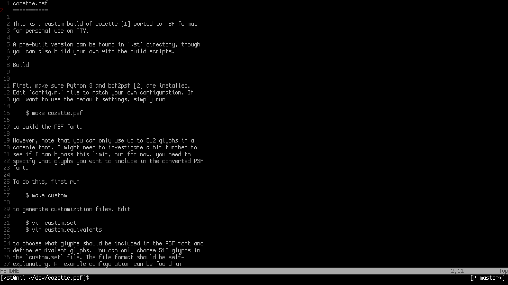

cozette.psf
===========

This is a custom build of [cozette][1] ported to PSF format
for personal use on TTY.

A pre-built version can be found in `kst` directory, though
you can also build your own with the build scripts.

Build
-----

First, make sure Python 3 and [bdf2psf][2] are installed.
Edit `config.mk` file to match your own configuration. If
you want to use the default settings, simply run

    $ make cozette.psf

to build the PSF font.

However, note that you can only use up to 512 glyphs in a
console font. I might need to investigate a bit further to
see if I can bypass this limit, but for now, you need to
specify what glyphs you want to include in the converted PSF
font.

To do this, first run

    $ make custom

to generate customization files. Edit

    $ vim custom.set
    $ vim custom.equivalents

to choose what glyphs should be included in the PSF font and
define equivalent glyphs. You can only choose 512 glyphs in
the `custom.set` file. The file format should be self-
explanatory. An example configuration can be found in
`kst` directory.

After you are done configuring, use

    $ make cozette.psf

to build the PSF font.

If you want a 2x scaled version of cozette, make sure
[bdfresize][3] is installed and run

    $ make cozette2x.psf

to build the scaled font (alternatively, you can use the
`-d` flag of `setfont`).

To install and use the built PSF fonts, run

    $ make install
    $ setfont cozette

on TTY, but make sure your `PSFDIR` is set up correctly in
`config.mk`.

[1]: https://github.com/slavfox/Cozette
[2]: http://deb.debian.org/debian/pool/main/c/console-setup/
[3]: http://openlab.ring.gr.jp/efont/dist/tools/bdfresize/
